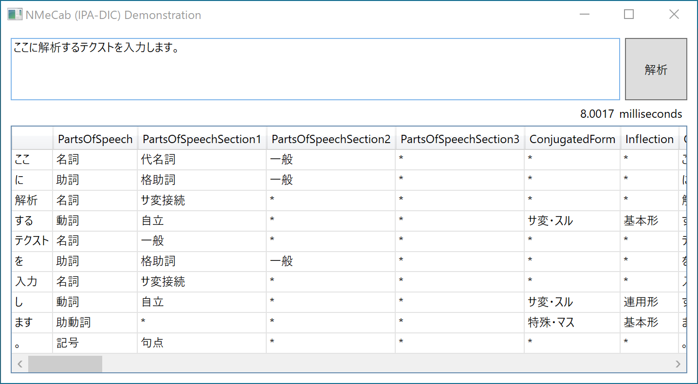

# NMeCabDemo
A small demonstration program for [NMeCab](https://github.com/komutan/NMeCab), a Japanese morphological analyzer developed on .NET.

### Note on package availability
As of this writing (May 2020), there are several nuget packages for MeCab/NMecab available, 
but the _official_ NMeCab packages ([LibNMeCab](https://www.nuget.org/packages/LibNMeCab) and [LibNMeCab.IpaDicBin](LibNMeCab.IpaDicBin)) 
that this demonstration uses are still in prerelease stage,
and you need to check `Include prerelease` check box to find them on `Manage NuGet Package for Solution...` on Visual Studio.

## What is NMeCab?

NMeCab is a C# port of the analysis library of a famous Japanese morphological analyzer [MeCab](https://github.com/taku910/mecab).
It is _not_ a wrapper around the C++ MeCab binary, but a complete rewriting in C# with its own additional features.

## What is this program, NMeCabDemo?

NMeCabDemo is a small demonstration program of NMeCab.

It is primarily for those who are not familiar with MeCab or other Japanese morphological analyzers to know what it does.
Those who know morphological analysis would not find anything exciting.

## Why did I write it?

I have a project that my application needs a Japanese morphological analysis in its functionality.
My application is written in C#, so I looked for a (technically and legally) suitable library to do the job.
NMeCab seemed the best solution.

I wrote this program primarily to learn how I can use it.
Unfortunately, the library was too _easy_ to use in its simple use cases, 
and I got not much insight from this experience... :)

## Environment

NMeCabDemo is written on the Visual Studio 2017 Express for .NET Framework 4.7.2 using WPF.

I used Framework 4.7.2 and WPF because my application targets them.
NMeCab itself is a .NET Standard library, 
so you can use it on wider ranges of frameworks.
